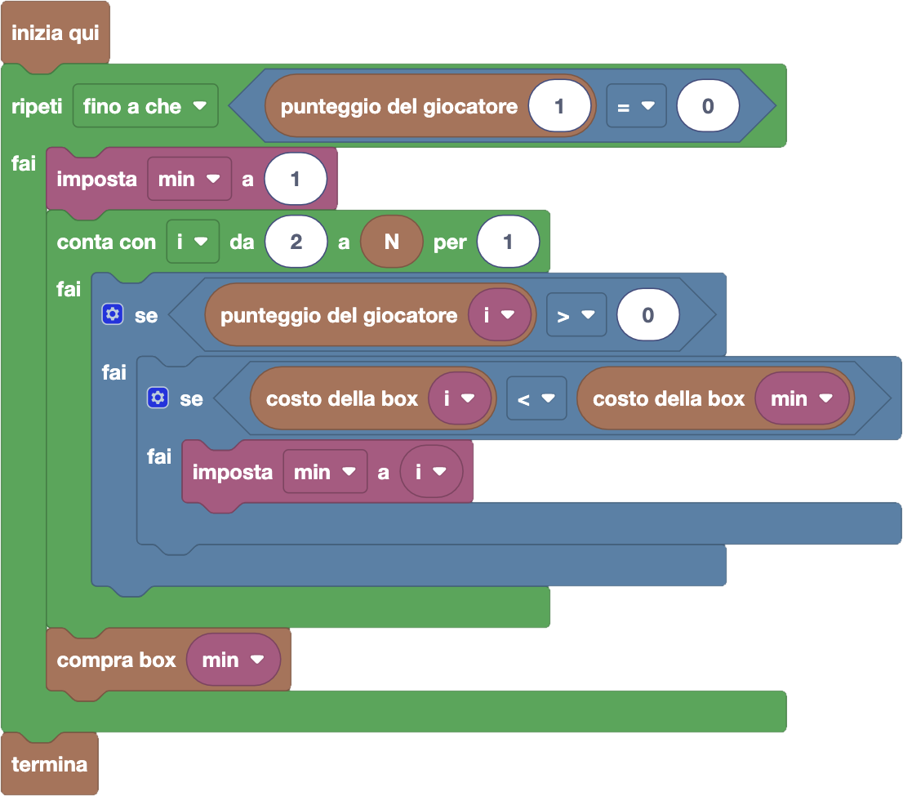

import initialBlocks from "./initial-blocks.json";
import customBlocks from "./s3.blocks.yaml";
import testcases from "./testcases.py";
import Visualizer from "./visualizer.jsx";

Allie Muschio ha deciso di iniziare a giocare a FarmCraft. Il gioco sembra abbastanza divertente, ma ha un piccolo problema:
Allie è ancora ultima nella graduatoria globale con zero punti. Potrebbe allenarsi per alzare il suo punteggio, ma Allie ha un piano migliore!

La graduatoria di FarmCraft contiene $N$ giocatori, con il giocatore in posizione $i$-esima a punteggio $P_i$.
Nello store del gioco, Allie ha visto che c'è la possibilità di comprare $N$ diverse box speciali, numerate da $1$ a $N$, ciascuna con un
diverso costo di $C_i$ carote. Comprando la box $i$-esima, Allie potrà abbassare di $1$ punto il punteggio della persona che
**in quel momento** sarà $i$-esima in graduatoria. Ogni box però può essere comprata un qualunque numero di volte.
Dato che Allie Muschio è la più facoltosa della fattoria, ha deciso di usare queste box
per abbassare il punteggio di tutti gli altri a zero e diventare così prima in classifica!
Hai a disposizione questi blocchi:

- `N`: il numero di giocatori di FarmCraft.
- `punteggio del giocatore` $i$: il punteggio del giocatore che in questo momento è $i$-esimo in graduatoria.
- `costo della box` $i$: costo in carote della box $i$-esima.
- `compra box` $i$: paga la box $i$-esima e abbassa di $1$ il punteggio del giocatore che al momento è $i$-esimo.
- `termina`: goditi la meritata vittoria.

Aiuta Allie ad azzerare il punteggio di tutti gli altri giocatori, spendendo meno possibile!

<Blockly
  customBlocks={customBlocks}
  initialBlocks={initialBlocks}
  testcases={testcases}
  visualizer={Visualizer}
/>

> Un possibile programma corretto è il seguente:
>
> 
>
> Secondo questo programma, la protagonista continua a comprare box finché persino il primo in classifica
> si ritrova con zero punti. Per capire quale box comprare a ogni volta, segue un'idea molto semplice:
> comprare ogni volta quello che costa meno, tra quelli che sono relativi ad una posizione in cui si trova
> qualcuno che ha ancora punti!
>
> Cerchiamo di trovare quale sia la box migliore, salvandola in una variabile _min_.
> Partiamo considerando la box $1$, che sicuramente si riferisce ad un giocatore che non è ancora a zero punti.
> Poi consideriamo tutte le altre box $i$ da $2$ a $N$ tramite un ciclo: se il giocatore della box $i$-esima
> ha ancora punti, e la box $i$-esima costa meno della box che abbiamo salvato in _min_, la sostituiamo a _min_.
>
> 
