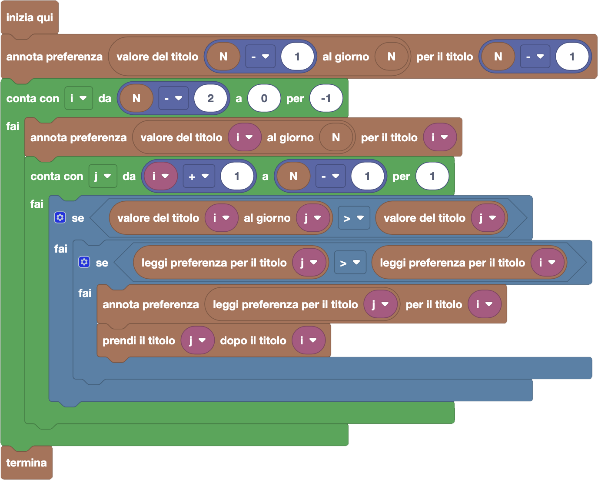

import initialBlocks from "./initial-blocks.json";
import customBlocks from "./s4.blocks.yaml";
import testcases from "./testcases.py";
import Visualizer from "./visualizer.jsx";

Per il suo compleanno, a Tip-Tap hanno regalato un titolo di investimento della **Carrot**. Il titolo oggi ha un valore $T_0$ carote,
ma il suo valore sale di $G_0$ carote ogni giorno, per cui tra $k$ giorni varrà $T_0 + k \cdot G_0$. Il nostro amico allora ha deciso di darsi alla finanza!

Tuttavia, un solo intermediario accetta di fare affari con i conigli, e con delle condizioni molto restrittive. Ogni giorno,
l'intermediario offre a Tip-Tap un singolo titolo: nel giorno $i$, un titolo che vale $T_i$ in quel giorno e il cui valore salirà di $G_i$
in ogni successivo giorno. Se il titolo che Tip-Tap possiede quel giorno vale più di quello offerto dall'intermediario, Tip-Tap può decidere di scambiare il
titolo che ha con quello offerto, ma senza ricevere nessun resto in cambio.

Quello che però l'intermediario non sa è che Tip-Tap è molto furbo, ed è riuscito a scoprire quali titoli offrirà l'intermediario per i prossimi $N$ giorni.
Usa queste informazioni per assicurarti il massimo guadagno dopo $N$ giorni!
Hai a disposizione questi blocchi per ispezionare la situazione:

- `N`: il numero di giorni.
- `valore del titolo` $i$: il valore $T_i$ del titolo che viene proposto nel giorno $i$.
- `guadagno del titolo` $i$: il guadagno $G_i$ che avrà il titolo $i$-esimo in ogni giorno successivo.
- `valore del titolo` $i$ `al giorno` $d$: il valore $T_i$ del titolo che viene proposto nel giorno $i$, incrementato di $G_i$ al giorno fino al giorno $d$ ($T_i + (d-i) \cdot G_i$).

Inoltre, hai a disposizione questi blocchi per annotarti informazioni di supporto:

- `annota preferenza` $x$ `per il titolo` $i$: annota un numero $x$ a tua scelta sul titolo $i$-esimo.
- `leggi preferenza per il titolo` $i$: leggi il numero che hai annotato sul titolo $i$-esimo.

Infine, hai a disposizione questi blocchi per riportare un piano finanziario:

- `prendi il titolo` $k$ `dopo il titolo` $i$: pianifica di prendere il titolo $k$ come prossimo titolo dopo $i$ (se prenderai il titolo $i$).
- `non prendere altri titoli dopo` $i$: pianifica di tenere il titolo $i$ fino alla fine degli $N$ giorni (e questo è il piano iniziale per tutti i titoli).
- `termina`: segui il piano che hai indicato con i blocchi fino alla fine degli $N$ giorni.

**Attenzione:** è possibile cambiare idea più volte su quale titolo prendere dopo un certo titolo $i$ (e se prenderne o no), usando più volte i blocchi relativi.
Nota inoltre che il tuo piano può pianificare un _prossimo titolo_ anche per titoli che in realtà non verranno poi presi nell'esecuzione finale.

<Blockly
  customBlocks={customBlocks}
  initialBlocks={initialBlocks}
  testcases={testcases}
  visualizer={Visualizer}
/>

> L'idea principale che serve a risolvere il problema è capire cosa annotare sui titoli. Supponiamo
> di annotare su ogni titolo un numero che rappresenta **quanto al massimo potremmo avere all'ultimo giorno**,
> **se prenderemo questo titolo e poi faremo le scelte migliori possibili**.
> Con questa idea, un possibile programma corretto è il seguente:
>
> 
>
> Secondo questo programma, scandiamo i titoli dall'ultimo all'indietro dall'ultimo fino al primo, per capire
> cosa possiamo annotarci sopra (e quale "freccia" mettere). Per l'ultimo ci sono poche scelte: dovremo per
> forza tenerlo, quindi non mettiamo frecce e annotiamo il valore che acquisisce all'ultimo giorno.
>
> Per gli altri titoli $i$, iniziamo comunque allo stesso modo, considerando cosa possiamo ottenere se li tenessimo
> fino alla fine, quindi annotando il valore che acquisirebbero all'ultimo giorno. Poi, però, dobbiamo consideriare
> se ad un certo punto ci potrebbe convenire scambiarli con un altro titolo!
>
> Iteriamo quindi sui titoli $j$ successivi, verificando prima se lo scambio ci verrebbe accettato dall'intermediario,
> e poi se lo scambio ci porterebbe vantaggio. Possiamo facilmente capire se ci porta vantaggio, andando a leggere
> l'annotazione che su quel titolo avremo già messo, e che ci dice quanto al massimo potremo fare dal titolo $j$
> in poi! Se questa è meglio di quello che abbiamo trovato finora per il titolo $i$, e lo scambio è accettabile,
> ipotizziamo di fare lo scambio: aggiorniamo quindi l'annotazione per $i$ e programmiamo di prendere $j$ dopo $i$.
>
> Ripetendo questo procedimento per tutti i titoli, andiamo a costruire il piano di investimento migliore!
>
> 
