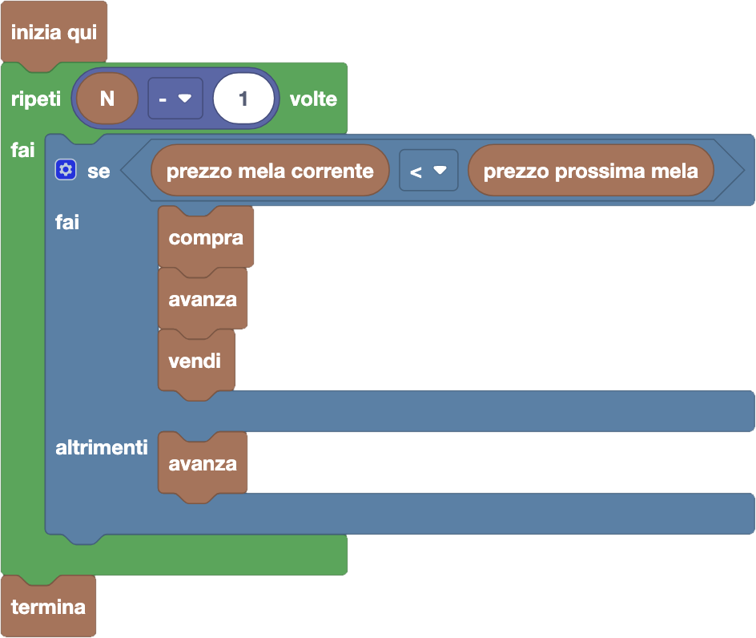

import initialBlocks from "./initial-blocks.json";
import customBlocks from "./s4.blocks";
import testcases from "./testcases.py";
import Visualizer from "./visualizer";
import { Hint } from "~/utils/hint";
import { toolbox } from "./toolbox.ts";

Tip-Tap si è appassionato alla compravendita di mele. Oggi vuole quindi visitare altri $N$ conigli da cui comprare e vendere mele, in ordine da sinistra verso destra:
una volta passato al prossimo coniglio, non può mai tornare indietro. Per ogni coniglio le mele hanno un prezzo diverso. Tip-Tap in ogni momento può trasportare al massimo una mela,
e all'inizio non ha mele. Tip-Tap è un affarista affermato quindi può permettersi di comprare qualsiasi mela. Inoltre, non gli interessa di rimanere con una mela alla fine:
vuole solo comprare e rivendere per il massimo profitto. Hai a disposizione questi blocchi:

- `N`: numero di conigli.
- `avanza`: procedi al prossimo coniglio.
- `compra`: compra una mela dal coniglio corrente.
- `vendi`: vendi una mela al coniglio corrente.
- `prezzo mela corrente`: prezzo di vendita e acquisto di mele dal coniglio corrente.
- `prezzo prossima mela`: prezzo di vendita e acquisto di mele dal prossimo coniglio.
- `hai una mela`: vero se stai trasportando una mela.
- `termina`: smetti di comprare e vendere mele.

Aiuta Tip-Tap a scegliere quando comprare e vendere mele mentre che visita i conigli, per guadagnare il più possibile!
 
<Hint label="descrizione figure per ipovedenti">
  Tip-Tap parte sempre dal primo coniglio (posizione 1).

  - **Livello 1:** fila di {testcases[0].N} conigli. I prezzi delle mele sono, in ordine: {testcases[0].prezziDesc}.
  - **Livello 2:** fila di {testcases[1].N} conigli. I prezzi delle mele sono, in ordine: {testcases[1].prezziDesc}.
  - **Livello 3:** fila di {testcases[2].N} conigli. I prezzi delle mele sono, in ordine: {testcases[2].prezziDesc}.
  - **Livello 4:** fila di {testcases[3].N} conigli. I prezzi delle mele sono, in ordine: {testcases[3].prezziDesc}.
</Hint>

<Blockly
  toolbox={toolbox}
  customBlocks={customBlocks}
  initialBlocks={initialBlocks}
  testcases={testcases}
  visualizer={Visualizer}
/>

> Da buon affarista, Tip-Tap è interessato a comprare una mela da un coniglio solo nel caso in cui possa rivenderla
> al coniglio immediatamente successivo ad un prezzo più alto, ottenendone quindi un profitto.
> Una soluzione è quindi la seguente.
>
> 
>
> Infatti, non c'è mai un vantaggio a tenere una mela più a lungo, saltando alcuni conigli prima di rivenderla.
> Se in una sequenza di conigli i prezzi sono in crescita, quello che conviene è comprare dal primo coniglio
> e rivendere all'ultimo: nel procedimento sopra, Tip-Tap in più vende e ricompra da tutti i conigli nel mezzo,
> ma questo non fa differenza sul guadagno finale. Quando invece alcuni conigli hanno prezzi discendenti,
> conviene saltarli del tutto aspettando la prossima sequenza di prezzi crescenti.
