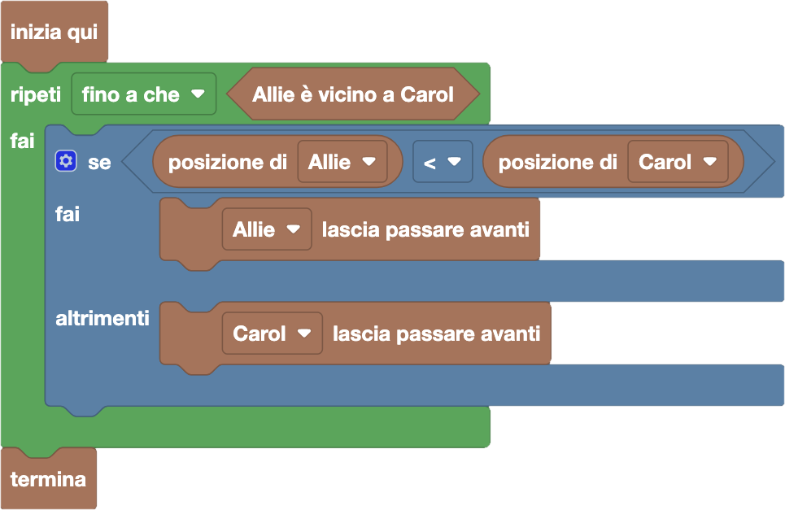

import initialBlocks from "./initial-blocks.json";
import customBlocks from "./s1.blocks";
import testcases from "./testcases.py";
import Visualizer from "./visualizer";
import { Hint } from "~/utils/hint";

Alcuni conigli sono in fila per il pranzo. Visto che la coda è lunga, Allie e Carol vogliono avvicinarsi per chiacchierare. 
Siccome non vogliono superare gli altri conigli in fila, l'unica cosa che possono fare è far passare avanti il coniglio subito
dietro di loro. Hai a disposizione i seguenti blocchi:

- `N`: il numero di conigli in fila.
- `posizione di Allie/Carol`: la posizione di Allie/Carol.
- `Allie/Carol lascia passare avanti`: fai passare davanti ad Allie/Carol il coniglio subito dietro di lei.
- `Allie è vicino a Carol`: vero se Allie e Carol sono in posizioni consecutive.
- `termina`: smetti di far passare avanti conigli e comincia a chiacchierare.

Aiuta Allie e Carol ad avvicinarsi per chiacchierare, facendo passare avanti meno conigli possibile!

<Hint label="descrizione figure per ipovedenti">
  Il visualizzatore mostra una fila di conigli in attesa al chiosco. Tra di loro ci sono Allie e Carol.
  - **Livello 1:** fila di {testcases[0].N} conigli. Allie è in posizione {testcases[0].B}, Carol è in posizione {testcases[0].C}.
  - **Livello 2:** fila di {testcases[1].N} conigli. Allie è in posizione {testcases[1].B}, Carol è in posizione {testcases[1].C}.
  - **Livello 3:** fila di {testcases[2].N} conigli. Allie è in posizione {testcases[2].B}, Carol è in posizione {testcases[2].C}.
  - **Livello 4:** fila di {testcases[3].N} conigli. Allie è in posizione {testcases[3].B}, Carol è in posizione {testcases[3].C}.
  - **Livello 5:** fila di {testcases[4].N} conigli. Allie è in posizione {testcases[4].B}, Carol è in posizione {testcases[4].C}.
</Hint>

<Blockly
  customBlocks={customBlocks}
  initialBlocks={initialBlocks}
  testcases={testcases}
  visualizer={Visualizer}
/>

> Per far incontrare le due amiche, quella delle due che si trova davanti nella fila dovrà far passare i conigli che ha dietro, fino a raggiungere l'altra.
> Infatti, l'altra non può avvicinarsi da dietro senza superare qualcuno!
> Un possibile programma corretto è quindi il seguente:
>
> 
>
> In questo programma, si continua a far passare avanti conigli fino a che Allie è vicino a Carol.
> In ogni passaggio, se Allie è davanti nella fila sarà lei a far passare avanti, altrimenti lo farà Carol.
> Al termine del ciclo le due amiche saranno finalmente vicine, e quindi possiamo terminare il programma.
