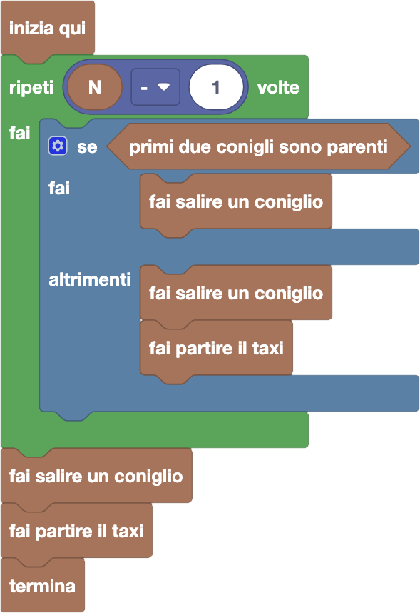

import initialBlocks from "./initial-blocks.json";
import customBlocks from "./s2.blocks";
import testcases from "./testcases.py";
import Visualizer from "./visualizer";
import { Hint } from "~/utils/hint";

Alcune famiglie di conigli stanno aspettando alla fermata dei taxi, per un totale di $N$ conigli in fila.
Ogni membro di una famiglia indossa la stessa maglietta (stesso colore e numero stampato sopra).
Nella fila, i conigli di una stessa famiglia sono sempre tutti vicini tra loro.
Ogni famiglia vuole salire su un **unico taxi solo per loro**, senza membri di altre famiglie
(la capienza dei taxi non è un problema, i conigli sanno come stringersi).

Hai a disposizione i seguenti blocchi:

- `N`: il numero di conigli in fila **all'inizio**.
- `primi due conigli sono parenti`: vero se i primi due conigli appartengono alla stessa famiglia.
- `fai salire un coniglio`: fai salire sul taxi corrente il primo coniglio della fila.
- `fai partire il taxi`: fai partire il taxi corrente e passa al taxi successivo.
- `termina`: smetti di far partire taxi.

Organizza la partenza dei taxi in modo che tutti siano soddisfatti!

<Hint label="descrizione figure per ipovedenti">
  Il visualizzatore mostra una fila di conigli in attesa di un taxi. Ogni coniglio indossa una maglietta colorata con un numero che rappresenta la sua famiglia. 

  - **Livello 1:** fila di {testcases[0].N} conigli. I numeri sulle magliette sono, in ordine: {testcases[0].G.join(', ')}.
  - **Livello 2:** fila di {testcases[1].N} conigli. I numeri sulle magliette sono, in ordine: {testcases[1].G.join(', ')}.
  - **Livello 3:** fila di {testcases[2].N} conigli. I numeri sulle magliette sono, in ordine: {testcases[2].G.join(', ')}.
  - **Livello 4:** fila di {testcases[3].N} conigli. I numeri sulle magliette sono, in ordine: {testcases[3].G.join(', ')}.
  - **Livello 5:** fila di {testcases[4].N} conigli. I numeri sulle magliette sono, in ordine: {testcases[4].G.join(', ')}.
</Hint>

<Blockly
  customBlocks={customBlocks}
  initialBlocks={initialBlocks}
  testcases={testcases}
  visualizer={Visualizer}
/>

> L'idea per risolvere questo problema è far salire i conigli sul taxi uno alla volta, mantenendo insieme solo quelli della stessa famiglia.
> Quando i primi due conigli della fila appartengono a famiglie diverse, significa che la famiglia è cambiata, quindi dobbiamo far partire il taxi prima di proseguire.
> Possiamo controllare questa situazione con il blocco `primi due conigli sono parenti`, che però richiede di avere almeno due conigli in fila.
> Per questo motivo, ripetiamo queste operazioni per `N-1` volte, finché restano almeno due conigli, e gestiamo poi a parte l'ultimo.
> Un possibile programma corretto è quindi il seguente:
> 
> 
> 
> In questo programma, per `N-1` volte facciamo salire un coniglio sul taxi.
> Se i primi due conigli non appartengono alla stessa famiglia, facciamo anche partire il taxi, così che ogni taxi contenga solo conigli della stessa famiglia.
> Dopo il ciclo resta un solo coniglio: lo facciamo salire sul taxi e poi facciamo partire l’ultimo taxi prima di terminare.
