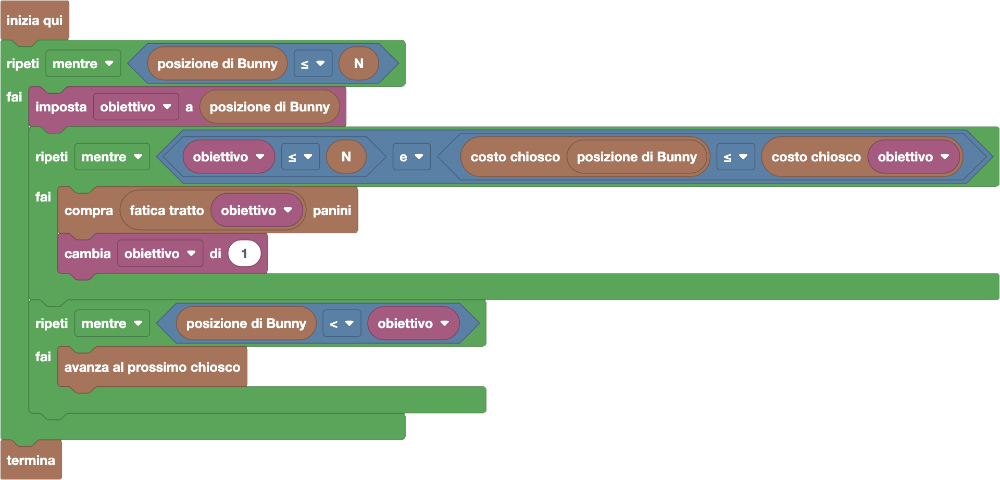

import initialBlocks from "./initial-blocks.json";
import customBlocks from "./s3.blocks";
import testcases from "./testcases.py";
import Visualizer from "./visualizer";
import { Hint } from "~/utils/hint";

Bunny è partito per una nuova passeggiata in montagna, composta da $N$ tratti di percorso.
I tratti sono separati da chioschi del pane: il primo chiosco si trova all'inizio del primo tratto, il secondo chiosco all'inizio del secondo tratto, e così via.
Il chiosco $i$ vende panini al prezzo di $P_i$ carote l'uno.

Ogni tratto può essere più o meno faticoso: la fatica $F_i$ del tratto $i$ indica quanti panini Bunny dovrà mangiare per percorrere quel tratto, e andare quindi dal chiosco $i$ al chiosco $i+1$.

Per fortuna, lo zaino di Bunny ha capienza infinita, ogni chiosco ha riserve infinite di panini,
e Bunny ha una carta di credito illimitata con cui può comprare tutti i panini che vuole.
Ma la banca verrà poi a riscuotere le carote spese, quindi meglio cercare di risparmiare!

Hai a disposizione i seguenti blocchi:

- `N`: il numero di tratti di percorso.
- `avanza al prossimo chiosco`: avanza fino al prossimo chiosco consumando i panini necessari.
- `panini nello zaino`: quanti panini ci sono attualmente nello zaino.
- `posizione di Bunny`: il numero del chiosco in cui ti trovi.
- `fatica tratto` $i$: la fatica $F_i$ del tratto $i$, cioè quanti panini servono per andare dal chiosco $i$ al chiosco $i+1$.
- `costo chiosco` $i$: il costo (in carote) di un singolo panino al chiosco $i$.
- `compra` $x$ `panini`: compra $x$ panini dal chiosco in cui ti trovi.
- `termina`: smetti di camminare.

Aiuta Bunny ad arrivare alla fine del percorso spendendo meno carote possibile!

<Hint label="descrizione figure per ipovedenti">
  Il visualizzatore mostra il percorso in montagna di Bunny, diviso in vari tratti. All'inizio di ogni tratto c'è un chiosco. Bunny parte sempre dal primo chiosco (posizione 1).

  - **Livello 1:** percorso di {testcases[0].N} tratti. I panini necessari per superare i tratti sono, in ordine: {testcases[0].L.slice(1).join(', ')}. I costi dei panini ai chioschi (in carote) sono: {testcases[0].P.slice(1).join(', ')}.
  - **Livello 2:** percorso di {testcases[1].N} tratti. I panini necessari per superare i tratti sono, in ordine: {testcases[1].L.slice(1).join(', ')}. I costi dei panini ai chioschi (in carote) sono: {testcases[1].P.slice(1).join(', ')}.
  - **Livello 3:** percorso di {testcases[2].N} tratti. I panini necessari per superare i tratti sono, in ordine: {testcases[2].L.slice(1).join(', ')}. I costi dei panini ai chioschi (in carote) sono: {testcases[2].P.slice(1).join(', ')}.
  - **Livello 4:** percorso di {testcases[3].N} tratti. I panini necessari per superare i tratti sono, in ordine: {testcases[3].L.slice(1).join(', ')}. I costi dei panini ai chioschi (in carote) sono: {testcases[3].P.slice(1).join(', ')}.
  - **Livello 5:** percorso di {testcases[4].N} tratti. I panini necessari per superare i tratti sono, in ordine: {testcases[4].L.slice(1).join(', ')}. I costi dei panini ai chioschi (in carote) sono: {testcases[4].P.slice(1).join(', ')}.
</Hint>

<Blockly
  customBlocks={customBlocks}
  initialBlocks={initialBlocks}
  testcases={testcases}
  visualizer={Visualizer}
/>

> Per spendere il minor numero di carote, Bunny deve approfittare dei chioschi più economici: quando si trova in un chiosco,
> conviene comprare abbastanza panini per arrivare al prossimo chiosco che ha un prezzo più basso, per non dover comprare panini in chioschi più cari.
> L'idea principale è questa: da un chiosco, cerchiamo il primo chiosco successivo con un costo minore, e compriamo abbastanza panini per arrivarci direttamente.
> Ripetiamo quindi questo procedimento finché non raggiungiamo la fine del percorso.
> Un possibile programma corretto è il seguente:
> 
> 
> 
> In questo programma, proseguiamo la passeggiata finché non superiamo l'ultimo chiosco (il numero $N$).
> In ogni iterazione cerchiamo un chiosco _obiettivo_, che sarà il primo chiosco successivo con costo minore
> (oppure la fine del percorso, se non esiste un chiosco successivo più conveniente).
> Per trovarlo, partiamo impostando come obiettivo il chiosco corrente.
> Poi ripetiamo i seguenti passi: compriamo i panini necessari per superare l'obiettivo corrente (pari alla fatica del tratto corrispondente)
> e spostiamo l'obiettivo al chiosco successivo.
> Continuiamo così finché non arriviamo ad un chiosco obiettivo con costo minore di quello corrente, oppure finché raggiungiamo la fine del percorso.
> Una volta trovato l'obiettivo, con un ulteriore ciclo Bunny avanza fino a quel chiosco, avendo già comprato abbastanza panini per farlo.
> 
> Al termine di tutte le iterazioni, Bunny avrà già superato l'ultimo chiosco e quindi raggiunto la fine del percorso, per cui il programma può terminare.
