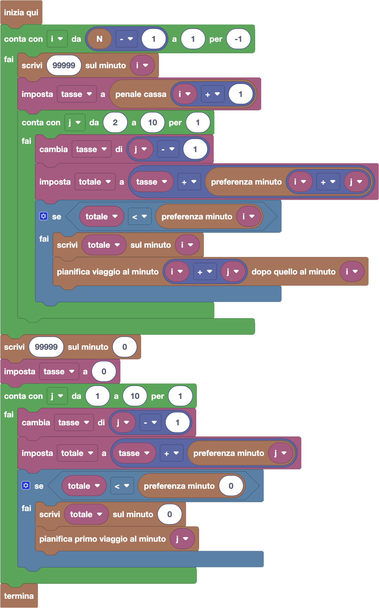

import initialBlocks from "./initial-blocks.json";
import customBlocks from "./s4.blocks";
import testcases from "./testcases.py";
import Visualizer from "./visualizer";
import { Hint } from "~/utils/hint";

Tip-Tap deve trasportare il pesce dal porto al mercato ittico con il suo furgone frigorifero!

Oggi arriveranno al porto $N$ casse di pesce, una per minuto, dal minuto $1$ al minuto $N$.

Il furgone può portare **quante casse vuole** in un unico viaggio, e può caricare e scaricare tutte le casse che trasporta in pochissimi secondi.
Ogni viaggio dura **due minuti**: un minuto per arrivare al mercato e scaricare tutte le casse trasportate, e un altro minuto per tornare al porto.
Quindi, se il furgone parte al minuto $i$, al minuto $i + 1$ sarà al mercato e al minuto $i + 2$ sarà di nuovo al porto, pronto per un nuovo viaggio.

Purtroppo, il porto chiede di pagare una **tassa di stazionamento** per tutte le casse che arrivano,
pari a **una carota per minuto** da quando la cassa arriva al porto a quando viene trasportata via con il furgone.
In particolare, se quando arriva una cassa il furgone è al porto, la carica subito e parte nello stesso minuto, nessuna tassa è dovuta.

Inoltre, il mercato ittico chiede di pagare una **penale per il caldo**:
se nel minuto $i$ in cui arriva una cassa il furgone è al mercato (cioè se è partito dal porto al minuto $i-1$), la cassa deve aspettare un minuto al caldo rovinando il pesce all'interno.

In questo caso, Tip-Tap dovrà anche pagare una penale di $P_i$ carote al mercato, oltre alla tassa portuale.

Prima che inizi la giornata, Tip-Tap deve pianificare quando fare i suoi viaggi, in modo da trasportare tutte le casse pagando meno carote possibile.
Hai a disposizione questi blocchi per ispezionare la situazione:

- `N`: il numero totale di casse da trasportare.
- `M`: la massima penale per una delle casse da trasportare.
- `penale cassa` $i$: penale $P_i$ da pagare se la cassa che arriva al minuto $i$-esimo deve aspettare il furgone per un minuto al caldo.

Per aiutarti a pianificare i trasporti, hai a disposizione $N+1$ lavagne, per ogni minuto dal minuto $0$ al minuto $N$. Puoi annotare informazioni di supporto sulle lavagne con questi blocchi:

- `scrivi` $x$ `sul minuto` $i$: scrivi sulla lavagna del minuto $i$-esimo il valore $x$.
- `preferenza minuto` $i$: il valore scritto sulla lavagna del minuto $i$-esimo (**zero se quella lavagna non esiste**).

Infine, hai a disposizione questi blocchi per gestire il furgone frigorifero:

- `pianifica primo viaggio al minuto` $i$: pianifica di fare il primo viaggio del furgone al minuto $i$-esimo.
- `pianifica viaggio al minuto` $i$ `dopo quello al minuto` $j$: pianifica di fare un viaggio al minuto $i$ come viaggio immediatamente successivo a quello al minuto $j$. **Attenzione** che il viaggio al minuto $i$ verrà effettivamente fatto solo se viene fatto anche quello al minuto $j$.
- `termina`: smetti di pianificare e fai partire il furgone secondo il piano registrato finora.

Aiuta Tip-Tap a capire quando far partire il furgone per portare tutte le casse di pesce dal porto al mercato ittico pagando meno carote possibile! 

_**Nota**: il furgone frigorifero può dover fare viaggi anche dopo il minuto $N$, se ci sono ancora casse da trasportare._

<Hint label="descrizione figure per ipovedenti">
  Il visualizzatore mostra il porto dove arrivano progressivamente le casse di pesce e il furgone frigorifero di Tip-Tap pronto per trasportarle al mercato.

  - **Livello 1:** sono previste {testcases[0].N} casse di pesce. Le penali per ogni cassa, in ordine di arrivo, sono: {testcases[0].P.join(', ')}.
  - **Livello 2:** sono previste {testcases[1].N} casse di pesce. Le penali per ogni cassa, in ordine di arrivo, sono: {testcases[1].P.join(', ')}.
  - **Livello 3:** sono previste {testcases[2].N} casse di pesce. Le penali per ogni cassa, in ordine di arrivo, sono: {testcases[2].P.join(', ')}.
  - **Livello 4:** sono previste {testcases[3].N} casse di pesce. Le penali per ogni cassa, in ordine di arrivo, sono: {testcases[3].P.join(', ')}.
  - **Livello 5:** sono previste {testcases[4].N} casse di pesce. Le penali per ogni cassa, in ordine di arrivo, sono: {testcases[4].P.join(', ')}.
</Hint>

<Blockly
  customBlocks={customBlocks}
  initialBlocks={initialBlocks}
  testcases={testcases}
  visualizer={Visualizer}
/>

> Per risolvere questo problema dobbiamo usare una tecnica chiamata [_programmazione dinamica_](https://training.olinfo.it/quizms/fibonacci-corso-6-programmazione-dinamica).
> Infatti, anche se in questo problema dobbiamo prendere una serie di decisioni (se far partire o far aspettare il furgone),
> non possiamo prendere le decisioni in modo [_greedy_](https://training.olinfo.it/quizms/fibonacci-corso-5-algoritmi-greedy) come nei problemi precedenti,
> cioè senza pensare alle conseguenze future. Infatti, decidere se partire o meno ci può far pagare penali diverse sulle casse che arriveranno dopo!
>
> Nella programmazione dinamica, per guidare le nostre scelte vogliamo prima annotare delle preferenze sulle lavagne che ci guidino nelle nostre decisioni.
> Come preferenza per il minuto $i$, ci segnamo **quanto dovremmo pagare al minimo dal minuto $i$ in poi**, assumendo che si faccia partire furgone proprio in quel minuto.
> Mentre che segnamo queste preferenze, possiamo pianificare quale dovrebbe essere il viaggio successivo a quello che potremmo fare al minuto $i$,
> che è quello che ci consente di pagare quel minimo che abbiamo segnato come preferenza.
> 
> Un possibile programma corretto è quindi il seguente:
> 
> 
> 
> Notiamo che la preferenza del minuto $N$ sarebbe **quanto dovremmo pagare al minimo dal minuto $N$ in poi**, assumendo che il furgone parta in quel minuto,
> che in realtà è pari a zero carote. Visto che tutte le lavagne partono da zero, non abbiamo bisogno di segnarci questa preferenza.
> 
> Per segnarci le preferenze, partiamo quindi dal penultimo minuto andando a ritroso fino al primo.
> Per ogni minuto $i$, scriviamo inizialmente sulla lavagna un valore molto alto (99999) come segnaposto, che poi andremo ad abbassare.
> Impostiamo quindi una variabile `tasse` che include sia la penale della cassa $i+1$ che dovrà aspettare, che le tasse di stazionamento che pagheremo fino alla prossima partenza.
> Proviamo quindi diverse possibilità su quanto tempo $j$ aspettare prima di far partire il furgone successivo, a partire da un minimo di $2$ minuti fino ad un massimo di $10$.
> Per ogni tentativo, aggiorniamo le `tasse` aggiungendo una tassa di una carota per ognuna delle $j-1$ casse che stiamo facendo aspettare in quel minuto.
> Calcoliamo quindi il costo totale sommando le tasse attuali al valore della preferenza del minuto $i+j$ a cui faremmo il prossimo viaggio,
> che ci dice quanto spenderemo da quel punto in poi. Se questo totale è è minore di quello già presente sulla lavagna $i$,
> possiamo aggiornare la lavagna con il nuovo valore e pianificare un viaggio al minuto $i+j$ come successivo di quello al minuto $i$.
>
> A questo punto, abbiamo calcolato le preferenze per tutti i minuti dal primo in poi, ma ci manca da decidere quando fare il primo viaggio.
> Facciamo questa scelta in modo simile, salvando la preferenza relativa sul minuto $0$, con la sola differenza che possiamo partire già dopo un minuto
> e non dobbiamo considerare nessuna penale per il primo viaggio.
> 
> **_Nota:_** Il motivo per il quale è sufficiente scegliere il prossimo viaggio fino al massimo a 10 minuti dopo da quello corrente,
> è legato alla velocità con cui cresce la tassa di stazionamento.
> Dato che ad ogni minuto arriva una cassa e bisogna pagare la tassa per lei e per tutte quelle già presenti,
> dopo $1$ minuto paghiamo $1$, dopo $2$ minuti paghiamo $1+2$, dopo 3 minuti paghiamo $1+2+3$, e così via.
> Se il prossimo viaggio fosse pianificato dopo $11$ minuti, dovremmo quindi pagare tasse dal primo al decimo minuto,
> per un totale di $10+9+\ldots+2+1$ $=$ $\frac{10 \times 11}{2} = 55$.
> Dato che in tutti i livelli la massima penale $M$ per una cassa non supera mai $30$, aspettare così tanto non è mai conveniente!
> Infatti, piuttosto che aspettare $11$ minuti e pagare $55$ di stazionamento, tanto vale aspettarne $5$ pagando $10$ di stazionamento,
> poi aspettare gli altri $6$ pagando $15$ di stazionamento, anche pagando una penale in più del costo massimo $M = 30$.
> Infatti $10 + 15 + 30 = 55$, lo stesso che se non avessimo fatto il viaggio in più!
