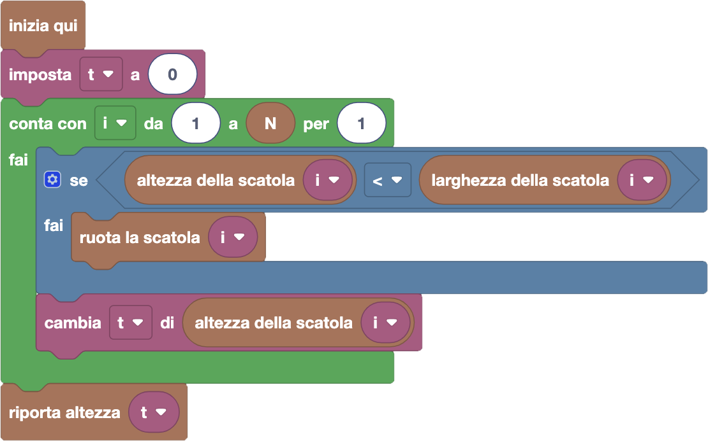

import initialBlocks from "./initialBlocks.json";
import customBlocks from "./customBlocks.yaml";
import testcases from "./testcases.py";
import Visualizer from "./visualizer.jsx";

Bunny e i suoi amici stanno cercando gli ovetti di pasqua nascosti in giro per la fattoria Fibonacci!
Bunny è convinto che ci sia un ovetto nascosto anche sul tetto e in altri punti alti della fattoria,
quindi ha deciso di costruire una torre che gli consenta di arrivare più in alto possibile.

Per farlo, ha impilato $N$ scatole rettangolari di varie dimensioni, che ha annotato nelle liste
$A$ e $L$: nella $i$-esima posizione delle due liste, ci sono i numeri $A_i$ e $L_i$ che rappresentano
rispettivamente l'altezza e la larghezza della $i$-esima scatola. Bunny sa queste dimensioni,
tramite le operazioni:

- `altezza della scatola i`: il numero $A_i$.
- `larghezza della scatola i`: il numero $L_i$.

Tuttavia, Bunny non è convinto di aver realizzato la torre più alta che potrebbe fare. Per aggiustare
la torre, Bunny può fare la seguente operazione:

- `ruota la scatola i`: ruota di 90 gradi la scatola $i$-esima, scambiando quindi di conseguenza
  l'altezza e larghezza $A_i$ e $L_i$ all'$i$-esima posizione delle liste $A$ e $L$.

Aiuta Bunny a realizzare la torre più alta! Aiutalo anche a capire se la torre gli basterà per
raggiungere il tetto, riportando l'altezza totale della torre con l'operazione:

- `riporta altezza t`: termina il programma riportando il numero $t$ come altezza della torre.

<Blockly
  customBlocks={customBlocks}
  initialBlocks={initialBlocks}
  testcases={testcases}
  debug={{ logBlocks: false, logJs: false, logVariables: false }}
  Visualizer={Visualizer}
/>

> Un possibile programma corretto è il seguente:
>
> 
>
> In questo programma, dopo aver inizializzato la variabile $t$ a zero, Bunny itera sulle $N$ scatole,
> numerandole tramite la variabile $i$ che cresce da $1$ a $N$ a ogni iterazione. In ciascun passo,
> controlla se l'altezza della scatola $i$-esima è minore della sua larghezza: in questo caso, conviene
> ruotarla per alzare la torre. Volendo inoltre calcolare l'altezza totale della torre, Bunny aggiunge
> l'altezza della scatola (possibilmente ruotata) alla variabile $t$. Una volta terminato di esaminare
> tutte le scatole, Bunny può terminare riportando il valore di $t$ come altezza della torre.