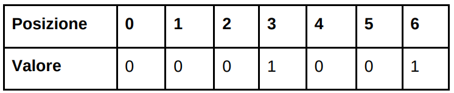

Data la funzione $f(x) = 2x \mod 7$ (ovvero $f(x)$ è il resto ottenuto dividendo $2x$ per $7$) si consideri la seguente
tabella, denominata BF1:

Una generica tabella di tipo BF rappresenta un insieme di interi.

La regola per inserire valori nella tabella BF è la seguente: inizialmente sono tutti zero. Se si vuole inserire in
BF un intero $x$, si deve applicare a $x$ la funzione $f$ e poi scrivere un $1$ nella posizione numero $f(x)$. Se era già
presente un $1$ in posizione $f(x)$ non si deve fare niente.

Ad esempio, se si vuole inserire nella tabella BF1 il numero $6$ non si deve far altro che osservare che $6\cdot 2$
modulo $7$ fa $5$ e inserire un $1$ in posizione $5$, ottenendo la tabella BF2:

Indicare la corretta fra le seguenti affermazioni, riferite alla prima tabella BF1:

- [ ] In BF1 è presente il numero $4$
- [ ] In BF1 non è presente il numero $19$
- [ ] In BF1 potrebbe essere presente il numero $6$
- [x] In BF1 potrebbe essere presente il numero $12$
