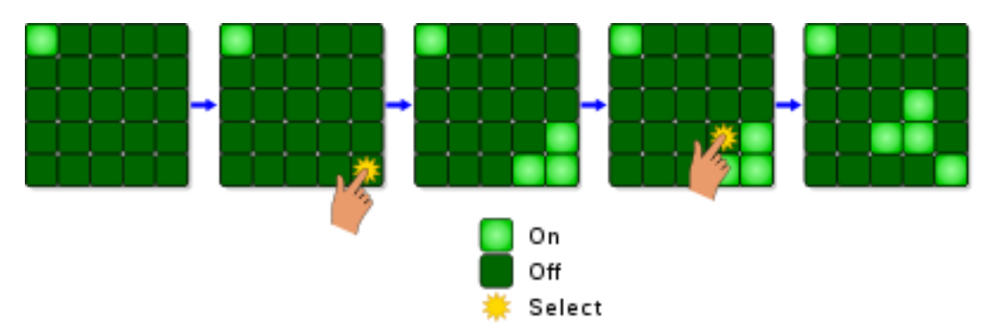
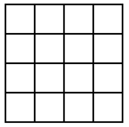

Nel gioco Lights Out si ha una matrice di $5\times 5$ luci, che possono essere accese o spente. Premendo su un
elemento della matrice, si cambia lo stato di quell'elemento e dei suoi quattro vicini (alto, basso, destra e
sinistra), come mostrato nella figura di seguito.

Si consideri una versione semplificata, con una matrice $4\times 4$ come quella mostrata nella figura qui sotto.

Inizialmente le luci sono tutte spente. Una mossa consiste nel premere un elemento della matrice. Qual è il
numero minimo di mosse che bisogna fare per arrivare alla configurazione in cui tutte le luci sono accese?

?> 4
