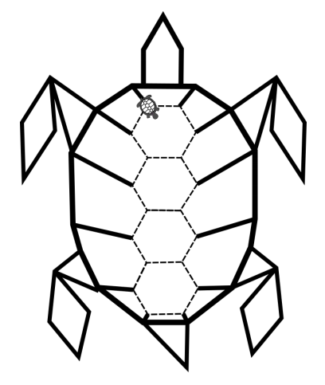

La grafica della tartaruga prevede che si possano impartire degli ordini di movimento a una tartaruga, che li
eseguirà lasciando sul terreno una traccia dei suoi movimenti, come se avesse una penna attaccata sotto la
pancia. Gli ordini possono essere impartiti tramite un semplice linguaggio, stando attenti che:

- le istruzioni destra e sinistra sono relative all'orientamento attuale della tartaruga, e il numero che segue è un angolo di rotazione (rispettivamente orario e antiorario) espresso in gradi;
- le istruzioni pennasu e pennagiu sollevano e abbassano rispettivamente la penna sotto la pancia della tartaruga: quando la penna è sollevata ovviamente non lascia tracce sul terreno;
- l'istruzione ripeti fa ripetere il blocco che segue, delimitato da parentesi graffe, per un numero di volte indicato a fianco dell'istruzione.



Quest’anno la tartaruga vuole realizzare un
autoritratto. Prima ha disegnato la sua sagoma a
matita (in figura la linea tratteggiata) e poi ha
iniziato a ricalcarla con la penna.
In questo momento la tartaruga si trova nel vertice
in alto a sinistra dell’esagono più alto ed è nella
condizione pennagiu, sapendo che gli esagoni
del carapace sono regolari e hanno lato l,
scegliere tra le seguenti quattro alternative quella
che **non** fa il disegno corretto.

- [ ] {" "}
  ```
  ripeti 4 {
      destra 60
      avanti l
      sinistra 60
      avanti l
  }
  ripeti 4 {
      sinistra 60
      avanti l
  }
  ripeti 3 {
      pennasu
      destra 180
      avanti l
      pennagiu
      ripeti 3 {
          sinistra 60
          avanti l
      }
  }
  ```
- [ ] {" "}
  ```
  ripeti 4 {
      destra 60
      avanti l
      sinistra 60
      avanti l
  }
  ripeti 4 {
      sinistra 60
      avanti l
  }
  ripeti 3 {
      pennasu
      sinistra 180
      avanti l
      pennagiu
      ripeti 3 {
          sinistra 60
          avanti l
      }
  }
  ```
- [x] {" "}
  ```
  ripeti 4 {
      avanti l
      destra 60
      sinistra 60
      avanti l
  }
  ripeti 4 {
      sinistra 60
      avanti l
  }
  ripeti 3 {
      pennasu
      destra 180
      avanti l
      pennagiu
      ripeti 3 {
          sinistra 60
          avanti l
      }
  }
  ```
- [ ] {" "}
  ```
  ripeti 4 {
      destra 60
      avanti l
      sinistra 60
      avanti l
  }
  ripeti 4 {
      sinistra 60
      avanti l
  }
  ripeti 3 {
      destra 180
      pennasu
      avanti l
      pennagiu
      ripeti 3 {
          sinistra 60
          avanti l
      }
  }
  ```
