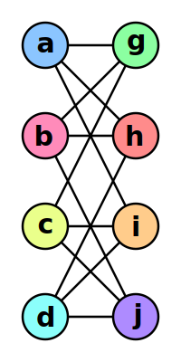
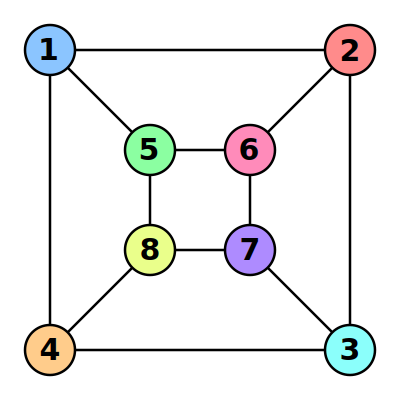

---
variants:
  - i: 0
    sol: 15
  - i: 1
    sol: 12
  - i: 2
    sol: 21
  - i: 3
    sol: 30
---

Una rete (chiamata anche grafo) è costituita da un insieme di punti (detti nodi), collegati tra di loro da linee (dette archi). La stessa rete può essere disegnata
in modi diversi.

Ad esempio, i due grafi qui sotto coincidono, ovvero è possibile trovare una corrispondenza tra i nodi del grafo di sinistra con quelli del grafo di destra, mantenendo gli archi tra i singoli nodi.

La corrispondenza è quella mostrata usando i colori dei nodi (a=1, b=6, c=8, d=3, g=5, h=2, i=4 e j=7).

Anche per i due grafi qui sotto è possibile trovare una corrispondenza.

Quanto vale la somma dei tre nodi della figura di destra che corrispondono ai nodi A, B ed F della figura di sinistra?

Ad esempio, se pensi che i nodi A, B ed F di sinistra corrispondano, rispettivamente, ai nodi $1$, $6$ e $9$ della figura di destra, la tua risposta dovrà essere $1+6+9=16$.

?> {sol}
