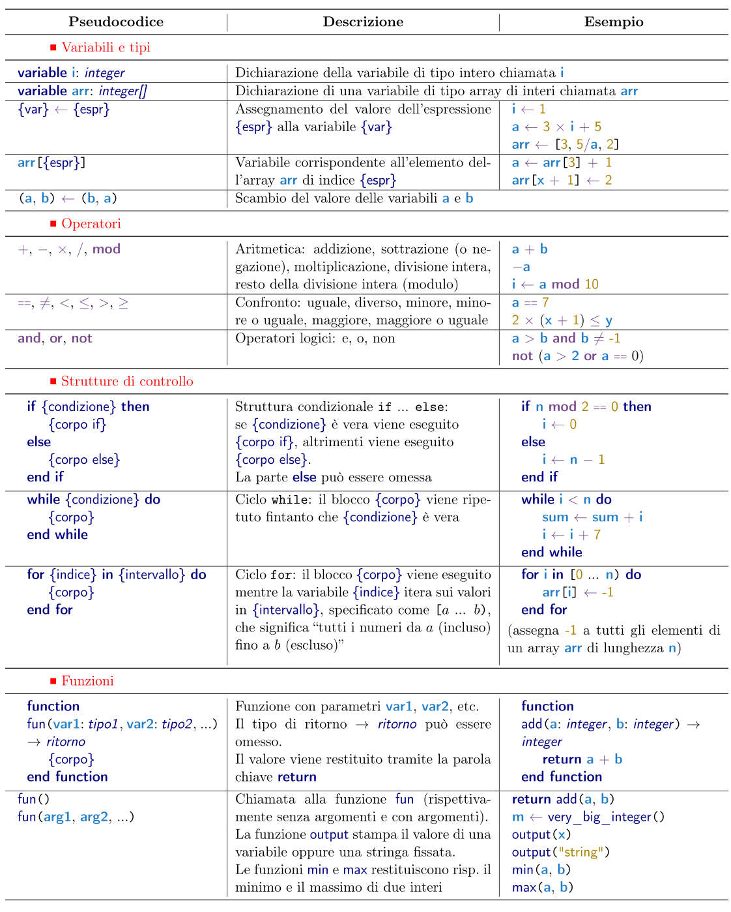

# Olimpiadi Italiane di Informatica 2023 -- Selezione scolastica

Ciao!
Ecco le informazioni essenziali sulla prova che stai per svolgere.
Ti consigliamo di leggerle attentamente.

## Regole di base

Ti è permesso:

- avere a disposizione una calcolatrice -- va bene qualunque tipo di calcolatrice, comprese quelle grafiche e la calcolatrice di sistema dell'eventuale dispositivo elettronico che stai usando (PC o dispositivo mobile);
- avere con te dei fogli bianchi (eventualmente a righe o quadretti);
- avere con te del materiale di cancelleria (penne, matite, gomma, etc.);
- andare in bagno in qualunque momento -- in tal caso, dovrai lasciare nell'aula dispositivi elettronici, il testo della prova, e altro materiale cartaceo;
- comunicare con il docente sorvegliante in caso di problemi tecnici.

Non ti è permesso:

- navigare su internet, se non all'indirizzo del sito della prova https://gara.scolastiche.olinfo.it;
- comunicare con i tuoi compagni;
- comunicare con il docente sorvegliante sul contenuto della prova;
- diffondere il testo della prova, o parte di esso, prima delle 20:00 del giorno della prova (16 dicembre).

## Formato della prova

Questa prova contiene _20 domande_, da svolgere in un tempo totale di _90 minuti_.
La prova consiste di quesiti a **scelta multipla** e quesiti a **domanda aperta numerica**, ed è divisa in tre parti:

- 6 quesiti a scelta multipla a **carattere logico-matematico**,
- 6 quesiti a scelta multipla di **programmazione** in pseudocodice, e
- 4 quesiti a **carattere algoritmico**, ciascuno con 2 domande aperte numeriche.

In ciascuna delle tre parti, i quesiti sono _indicativamente_ (ma non esattamente) ordinati per difficoltà crescente.
_Attenzione_: la difficoltà è spesso soggettiva! Se stai passando tanto tempo cercando di risolvere un quesito, considera di dare uno sguardo al successivo, o a quelli di un’altra categoria!

## Punteggio

Tutti i quesiti a _scelta multipla_ presentano 5 opzioni, di cui **solo una** è corretta.
Il punteggio assegnato per tali quesiti è:

- 5 punti per una risposta _corretta_;
- 1 punto per una risposta _in bianco_;
- 0 punti per una risposta _errata_.

Ogni _domanda aperta numerica_ richiede come risposta un numero intero (eventualmente negativo).
Il punteggio assegnato per tali domande è:

- 5 punti per una risposta _corretta_;
- 0 punti per una risposta _errata_ o _in bianco_.

In particolare, il punteggio massimo ottenibile per un quesito a carattere algoritmico è 5 + 5 = 10.

## Quesiti di programmazione e pseudocodice

I quesiti di programmazione presentano semplici programmi scritti in _pseudocodice_.
Qui sotto puoi trovare un riassunto della sintassi dello pseudocodice, oppure
[scarica la guida completa](https://www.olimpiadi-informatica.it/images/Pseudocodice.pdf) in PDF.

