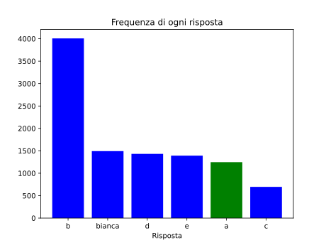

Una tessera del domino è un rettangolo $2 \times 1$ composto da due quadrati, contenenti due numeri **distinti** tra $1$ e $6$ (rappresentati da pallini).

Sul tavolo sono presenti le due tessere mostrate di seguito. Hai inoltre a disposizione una quantità illimitata di ciascun tipo di tessera. Quanti modi ci sono di inserire **tre tessere** tra le due esistenti, in modo che ogni coppia di quadrati adiacenti appartenenti a tessere diverse contenga lo stesso numero?
(Due modi si considerano distinti anche se usano le stesse tessere in ordine diverso.)

Ad esempio, un possibile modo di posizionare le tre tessere è il seguente:

- [x] $21$
- [ ] $36$
- [ ] $19$
- [ ] $25$
- [ ] $30$

> La risposta è $21$.
> 
> Le tre tessere inserite devono essere della forma $4$--$x$, $x$--$y$ e $y$--$1$, dove $x$ e $y$ sono numeri incogniti soggetti alle condizioni $3 \ne x$, $x \ne y$ e $y \ne 1$.
> 
> La prima condizione è soddisfatta scegliendo $x$ tra i numeri da $1$ a $6$ diversi da $3$, ovvero per $5$ scelte di $x$.
> Allo stesso modo, la terza condizione è soddisfatta per $5$ scelte di $y$ (i numeri da $2$ a $6$).
> Quindi, se ignoriamo la seconda condizione, ci sono $5 \cdot 5 = 25$ modi di scegliere $x$ e $y$.
> Di questi, quelli che non soddisfano la seconda condizione sono quelli in cui $x = y$, che sono $4$:
> infatti $x$ e $y$ non possono valere né $3$ né $1$, e pertanto vanno bene solo i $4$ valori $2, \, 3, \, 5, \, 6$.
> 
> La risposta si ottiene sottraendo questi $4$ casi dai $25$ contati prima, e quindi vale $25 - 4 = 21$.
> 
> 
