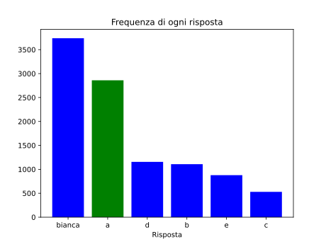

Roberto ha una lista di $n \geq 2$ numeri **interi positivi distinti**, dove $n$ è ignoto. Per ogni possibile coppia di numeri distinti, ne scrive la somma su una lavagna. Poi, se un numero è presente più di una volta, ne elimina tutte le occorrenze **tranne una**. Alla fine, rimangono $k$ numeri sulla lavagna.

Quale tra i seguenti **non può** essere il valore di $k$?

- [x] $4$
- [ ] $5$
- [ ] $6$
- [ ] $7$
- [ ] $8$

> La risposta è $4$.
> 
> Se Roberto ha al massimo $3$ numeri (cioè $n \le 3$) le possibili coppie di numeri sono al più $3$, e quindi anche $k$ lo è.
> Supponiamo, invece, che $n \ge 4$, e siano $a < b < c < d$ quattro dei numeri che ha Roberto.
> Le somme $a + b$, $a + c$, $a + d$, $b + d$, $c + d$ sono tutte distinte, e anzi, sono una minore della successiva:
> ad esempio, $a + b < a + c$ è equivalente a $b < c$, e $a + d < b + d$ è equivalente a $a < b$.
> Quindi, in questo caso $k \ge 5$.
> Questo dimostra che $k$ non può essere uguale a $4$.
> 
> Anche se non necessario per risolvere l'esercizio, facciamo vedere come le risposte $5$, $6$, $7$ e $8$ siano tutte possibili.
> 
> - Per $k = 5$, l'insieme di numeri $\{1, \, 2, \, 3, \, 4\}$ ha come somme i numeri $3, \, 4, \, 5, \, 6, \, 7$.
> - Per $k = 6$, l'insieme di numeri $\{1, \, 2, \, 3, \, 5\}$ ha come somme i numeri $3, \, 4, \, 5, \, 6, \, 7, \, 8$.
> - Per $k = 7$, l'insieme di numeri $\{1, \, 2, \, 3, \, 4, \, 5\}$ ha come somme i numeri $3, \, 4, \, 5, \, 6, \, 7, \, 8, \, 9$.
> - Per $k = 8$, l'insieme di numeri $\{1, \, 2, \, 3, \, 4, \, 6\}$ ha come somme i numeri $3, \, 4, \, 5, \, 6, \, 7, \, 8, \, 9, \, 10$.
> 
> 
