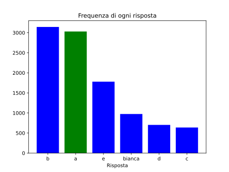

La seguente funzione prende come argomenti tre interi `a`, `b`, `c` (non necessariamente distinti) e ritorna la loro *mediana*, ovvero il numero che occupa la posizione centrale quando vengono ordinati. Ad esempio, la mediana di $5$, $3$ e $10$ è $5$, e la mediana di $4$, $1$ e $1$ è $1$.

Tuttavia, alcune righe di pseudocodice, indicate con `[???]`, sono mancanti.

(Si ricorda che, ad esempio, l'istruzione `(a, b) <- (b, a)` scambia i valori di `a` e `b`.)

```srs id=main inline-code-context=median.1
function median(a: integer, b: integer, c: integer) -> integer
    [???]
    if b > c then
        (b, c) <- (c, b)
    end if
    if a > b then
        (a, b) <- (b, a)
    end if
    return b
    <placeholder>
end function
```

Quale delle seguenti può essere la parte mancante?

- [x] ` `
    ```srs context=main.median.0
    if a > b then
        (a, b) <- (b, a)
    end if
    ```
- [ ] ` `
    ```srs context=main.median.0
    if a < c then
        (a, c) <- (c, a)
    end if
    ```
- [ ] ` `
    ```srs context=main.median.0
    (a, c) <- (c, a)
    ```
- [ ] ` `
    ```srs context=main.median.0
    if a < b then
        (a, b) <- (b, a)
    end if
    ```
- [ ] La funzione è corretta così com'è, non sono necessarie ulteriori righe di pseudocodice

> La risposta è
> 
> ```srs context=main.median.0
> if a > b then
>     (a, b) <- (b, a)
> end if
> ```
> 
> Vediamo cosa fa la funzione dopo averla completata nel modo proposto.
> 
> 1. Per prima cosa, le due variabili `a` e `b` vengono ordinate, scambiandone i valori se necessario.
> 2. A questo punto, `b` e `c` vengono ordinate. In questo momento, `c` contiene il massimo dei tre valori iniziali.
> 3. Per finire, `a` e `b` vengono nuovamente ordinate. Adesso `b` contiene il massimo dei due valori più piccoli, ovvero il valore centrale (la mediana)!
> 
> *Approfondimento:* Difatto, la funzione <code className="inline-code">median</code> implementa una versione a tre variabili del **BubbleSort**, uno dei più semplici (ma poco efficienti) algoritmi di ordinamento.
> 
> 
