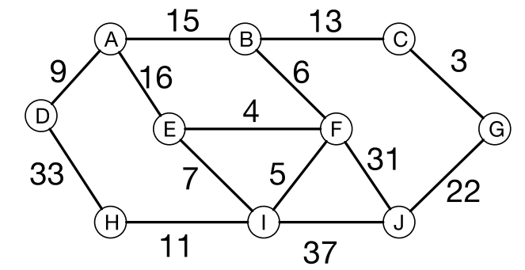

In un vecchio edificio ci sono 10 computer che devono essere collegati in rete. Dato l’elevato spessore delle
pareti, non è possibile usare una rete wifi e si decide, quindi, di collegarli via cavo. Non sono possibili tutti i
collegamenti, e ogni collegamento ha un costo diverso. Si deve aiutare a progettare la rete scegliendo i nove
collegamenti necessari per fare in modo che ogni computer sia collegato alla rete (ovvero ad almeno un altro
computer) e che il costo complessivo sia minimo. Dopo che i nove collegamenti saranno stati scelti, indicare
il costo totale, pari alla somma dei costi dei nove collegamenti selezionati.

?> 88
