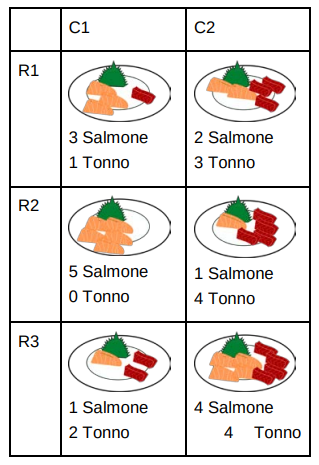

La famosa Sushi Squad, composta da 5 studenti delle scuole
superiori, si trova nel noto sushi bar Minimax Hao. Dal tavolo del
sashimi (riportato in figura) i 5 protagonisti possono prendere un
solo piatto, ma la squadra si divide in 2: gli amanti del salmone
(S) e gli amanti del tonno (T), in cui ognuna delle due fazioni
vuole che dal tavolo venga preso il piatto contenente la maggior
quantità del pesce preferito.

Le due squadre S e T si disputano la scelta del piatto giocando
secondo questa logica: la squadra S ha diritto a selezionare una
riga, la squadra T una colonna.
Valutare i due seguenti scenari.

A) Sia la squadra S ad iniziare il gioco.
S seleziona la riga in modo tale che, qualunque sia la colonna che sceglierà T nella mossa successiva, sia
massimo il numero minimo di filetti di salmone nel piatto. T, quando arriva il suo turno, sceglie semplicemente
il piatto con più filetti di tonno.

B) Sia la squadra T ad iniziare il gioco.
T seleziona la colonna in modo tale che, qualunque sia la riga scelta da S nella mossa successiva, sia
massimo il numero minimo di filetti di tonno nel piatto. Quando arriva il turno di S, questa sceglie
semplicemente il piatto con più filetti di salmone.
Si devono indicare RA e CA (ovvero i numeri di riga e colonna scelti nello scenario A) e RB e CB (ovvero
i numeri di riga e colonna scelti nello scenario B). Per esempio, la risposta “1” (numero intero di una sola
cifra) per RA indica che si intende dare come risposta la prima riga dello scenario A.

Rispondere concatenando i valori RA, CA, RB, CB.

?> 1232
