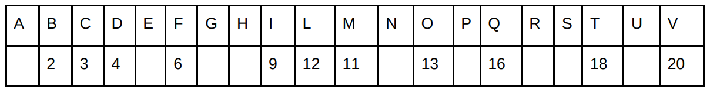

Un file di testo conteneva due diverse funzioni per il calcolo del numero di modi diversi in cui è possibile
ordinare `n` oggetti.
Le linee dello pseudocodice sono state accidentalmente disordinate, come riportato qui sotto.

Per ricostruire l'ordinamento corretto delle linee di codice è necessario produrre una lista di coppie (LETT,
NUM), in cui LETT corrisponde alla lettera che identifica una riga, come indicato sopra e NUM corrisponde al
numero che tale riga avrebbe nell'ordinamento corretto (nota: i numeri di riga partono da 1), come indicato
nella seguente griglia, in cui alcuni numeri sono già stati inseriti:

Si chiede quindi di riportare i numeri corretti associati alle lettere A, E, G, H, N, P, R, S e U che completino
correttamente la suddetta griglia. Rispondere concatenando i numeri di riga associati alle lettere mancanti.

?> 10715815141719
