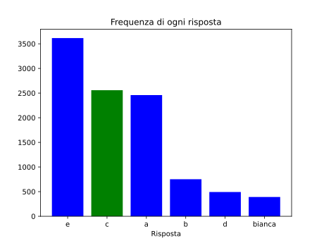

L'Isola delle Olimpiadi di Informatica ha $999$ abitanti, ognuno dei quali è un cavaliere o un furfante. I cavalieri dicono sempre la verità, mentre i furfanti dicono sempre e solo il falso. Un giornalista arriva sull'isola e parla con un abitante che è parte del **gruppo più numeroso** tra i due, chiedendogli: "Cosa puoi dirci sugli abitanti dell'isola?".

Quale o quali tra le seguenti affermazioni sono risposte possibili?

1. "Ci sono più cavalieri che furfanti"
2. "Ci sono più furfanti che cavalieri"
3. "I cavalieri sono tanti quanti i furfanti"

- [x] Solo la $1$ e la $3$
- [ ] Solo la $1$
- [ ] Solo la $2$
- [ ] Solo la $2$ e la $3$
- [ ] Tutte le risposte sono possibili

> La risposta è **Solo la $1$ e la $3$**.
>
> L'affermazione $1$ può essere detta sia da un cavaliere (nel qual caso sarebbe vera: il cavaliere appartiene al gruppo più numeroso, e quindi ci sono più cavalieri che furfanti), sia da un furfante (nel qual caso sarebbe falsa: il furfante appartiene al gruppo più numeroso, e quindi ci sono più furfanti che cavalieri).
>
> L'affermazione $3$ può essere detta da un furfante: infatti, essendo gli abitanti $999$ (che è un numero dispari), l'affermazione è sicuramente falsa.
>
> L'affermazione $2$ non può essere detta né da un cavaliere, né da un furfante: se venisse detta da un cavaliere, il gruppo più numeroso sarebbe quello dei cavalieri, e l'affermazione sarebbe falsa; se venisse detta da un furfante, il gruppo più numeroso sarebbe quello dei furfanti, e l'affermazione sarebbe vera.
>
> 
