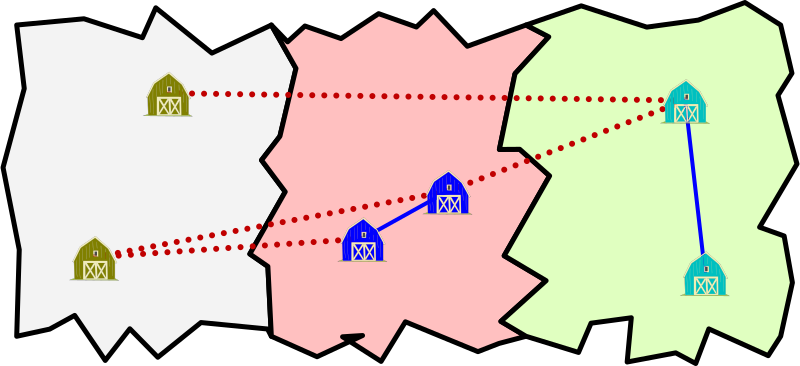
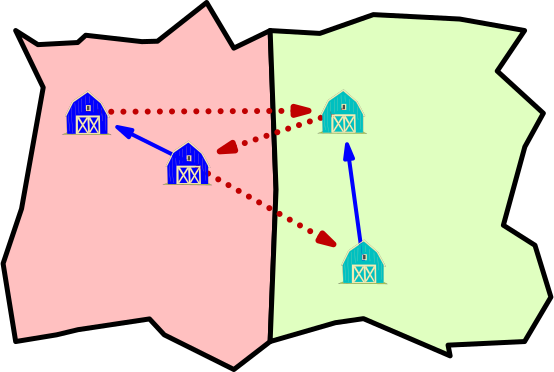

import variants from "./variants.py";

A _Olinfolandia_ ci sono $\js{n}$ Stati e ognuno di essi ha al suo interno $10$ città.
Valerio è stato incaricato di costruire delle strade **bidirezionali** per connettere le città: può costruire una strada che connette due città dello stesso Stato con costo $1$ e città di Stati diversi con costo $2$.
Per esempio, se ci fossero $3$ Stati con $2$ città ciascuno, si potrebbero collegare come in figura. Questo piano costa $2 \times 4 + 1 \times 2 = 10$:

In questo esempio, ci sono anche altri piani validi, ciascuno con un costo di $7$ o più.

Ricordando che a _Olinfolandia_ ci sono $\js{n}$ Stati con $10$ città, se Valerio costruisce strade **bidirezionali**, quanto deve spendere al minimo per fare in modo che da ogni città si possa raggiungere ogni altra città?

?> {ans1}

> Dato che le strade all'interno dello stesso Stato costano poco, conviene intanto collegare le città all'interno dello stesso Stato. Per ogni Stato servono $9$ strade. Ad esempio, colleghiamo la città $1$ con la città $2$, la città $2$ con la città $3$, ..., la città $9$ con la città $10$. Il costo parziale fino a questo punto è quindi $\js{n} \times 9 = \js{n*9}$.
> Adesso dobbiamo anche connettere gli Stati tra di loro, e servono altre $\js{n-1}$ strade di costo $2$: ad esempio, se colleghiamo l'ultima città di ogni Stato (tranne l'ultimo) con la prima di quello successivo. Il costo totale è quindi $\js{2*(n-1)} + \js{n*9} = \js{2*(n-1) + n*9}$.
>
> 

---

Mettiamo ora che le strade che Valerio costruisce siano **unidirezionali**, come in questo esempio:

Questo piano costa $3 \times 2 + 2 \times 1 = 8$, e consente di poter andare da ogni città ad ogni altra rispettando i versi delle strade.
Come prima, ci sono anche altri piani validi, ciascuno con un costo di $6$ o più.

Ricordando che a _Olinfolandia_ ci sono $\js{n}$ Stati con $10$ città, se Valerio costruisce strade **unidirezionali**, quanto deve spendere al minimo per fare in modo che da ogni città si possa raggiungere ogni altra città?

?> {ans2}

> Nella versione precedente del problema, abbiamo formato una linea composta da tutte le $\js{n*10}$ città. Assegniamo lo stesso verso a tutte le strade della linea, in modo che dalla prima città si possa raggiungere l'ultima. Ma in questo modo dall'ultima città non se ne può raggiungere nessun'altra! Per rimediare, basta creare una nuova strada che collega l'ultima città alla prima, pagando un costo aggiuntivo di $2$, per un totale di $\js{2*n + n*9}$.
>
> 
