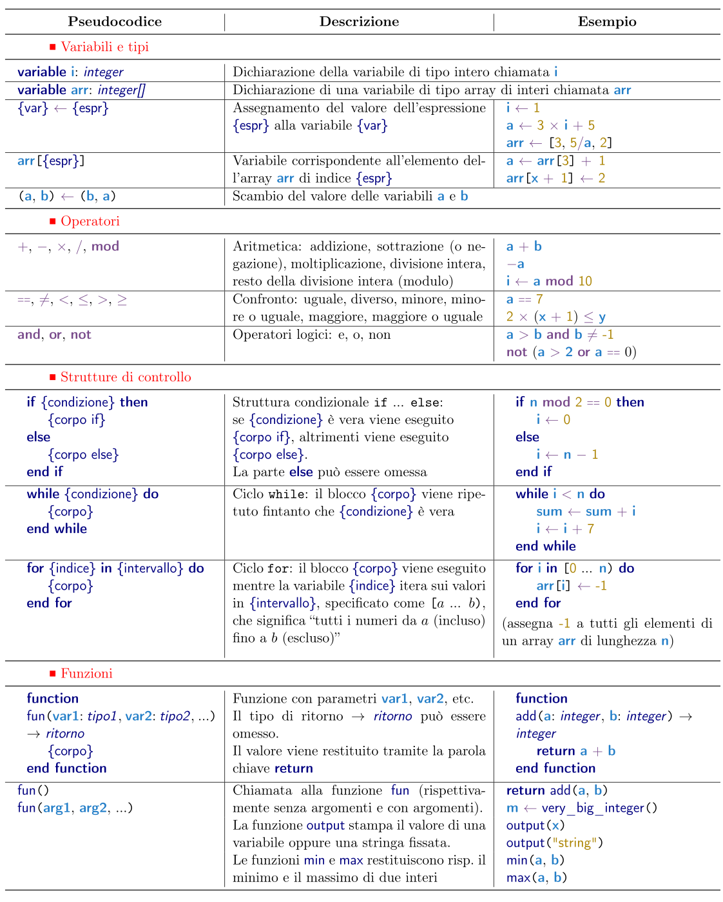

Ciao! Ecco le informazioni essenziali sulla prova che stai per svolgere. Ti consigliamo di leggerle attentamente.

## Regole di base

Ti è permesso:

- avere a disposizione una calcolatrice -- va bene qualunque tipo di calcolatrice, comprese quelle grafiche e la calcolatrice di sistema dell'eventuale dispositivo elettronico che stai usando (PC o dispositivo mobile);
- avere con te dei fogli bianchi (eventualmente a righe o quadretti);
- avere con te del materiale di cancelleria (penne, matite, gomma, etc.);
- andare in bagno in qualunque momento -- in tal caso, dovrai lasciare nell'aula dispositivi elettronici, il testo della prova, e altro materiale cartaceo;
- comunicare con il docente sorvegliante in caso di problemi tecnici.

Non ti è permesso:

- navigare su internet, se non all'indirizzo del sito della prova;
- comunicare con i tuoi compagni;
- comunicare con il docente sorvegliante sul contenuto della prova;
- diffondere il testo della prova, o parte di esso, prima delle 20:00 del giorno della prova (12 dicembre).

## Formato della prova

La prova contiene _10 problemi_ da risolvere in _90 minuti_, ed è divisa in due parti:
- sette problemi di **pensiero logico-algoritmico**, e
- tre problemi di interpretazione di **procedimenti procedurali** come programmi a blocchi.

In entrambe le parti i problemi sono **in ordine casuale**, e quindi non in ordine di difficoltà.
Ogni problema comprende _due domande_, valutate separatamente.
La prima domanda è **sempre più semplice**, e può aiutare a rispondere alla seconda domanda (che in genere è da considerarsi difficile).

## Punteggio

Le domande possono essere a scelta multipla oppure a risposta aperta numerica.
Tutte le domande a _scelta multipla_ presentano 5 opzioni, di cui **solo una** è corretta. Il punteggio assegnato per tali domande è:

- 5 punti per una risposta _corretta_;
- 1 punto per una risposta _in bianco_;
- 0 punti per una risposta _errata_.

Ogni _domanda aperta numerica_ richiede come risposta un numero intero (eventualmente negativo). Il punteggio assegnato per tali domande è:

- 5 punti per una risposta _corretta_;
- 0 punti per una risposta _errata_ o _in bianco_.

## Quesiti di programmazione e pseudocodice

I quesiti di programmazione presentano semplici programmi scritti in _pseudocodice_. Qui sotto puoi trovare un riassunto della sintassi dello pseudocodice, oppure [scarica la guida completa](/Pseudocodice.pdf) in PDF.

